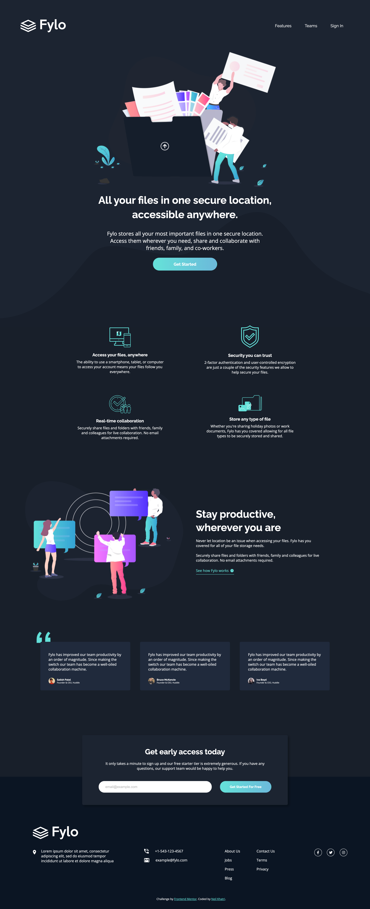

# Frontend Mentor - Fylo dark theme landing page solution

This is a solution to the [Fylo dark theme landing page challenge on Frontend Mentor](https://www.frontendmentor.io/challenges/fylo-dark-theme-landing-page-5ca5f2d21e82137ec91a50fd). Frontend Mentor challenges help you improve your coding skills by building realistic projects. 

## Table of contents

- [Overview](#overview)
  - [The challenge](#the-challenge)
  - [Screenshot](#screenshot)
  - [Links](#links)
- [My process](#my-process)
  - [Built with](#built-with)
  - [Continued development](#continued-development)
- [Author](#author)

## Overview

### The challenge

Users should be able to:

- View the optimal layout for the site depending on their device's screen size
- See hover states for all interactive elements on the page

### Screenshot

The completed mobile screenshot is extremely long so if you want to see it, look in the design folder for **completed-mobile.png**.

### Links

- Solution URL: [Add solution URL here](https://your-solution-url.com)
- Live Site URL: [Add live site URL here](https://your-live-site-url.com)

## My process

### Built with

- Semantic HTML5 markup
- CSS custom properties
- Flexbox
- CSS Grid
- [Font Awesome Icons](https://fontawesome.com/)

### Continued development

This was a rather basic challenge as I have been a bit more busy with uni at the time and so I wanted a lighter challenge to continue coding everyday. Moving forward, I'd love to continue completed projects with more JavaScript or even creating more React apps.

## Author

- Frontend Mentor - [@nkhatri7](https://www.frontendmentor.io/profile/nkhatri7)
- LinkedIn - [Neil Khatri](https://www.linkedin.com/in/neilkhatri/)
