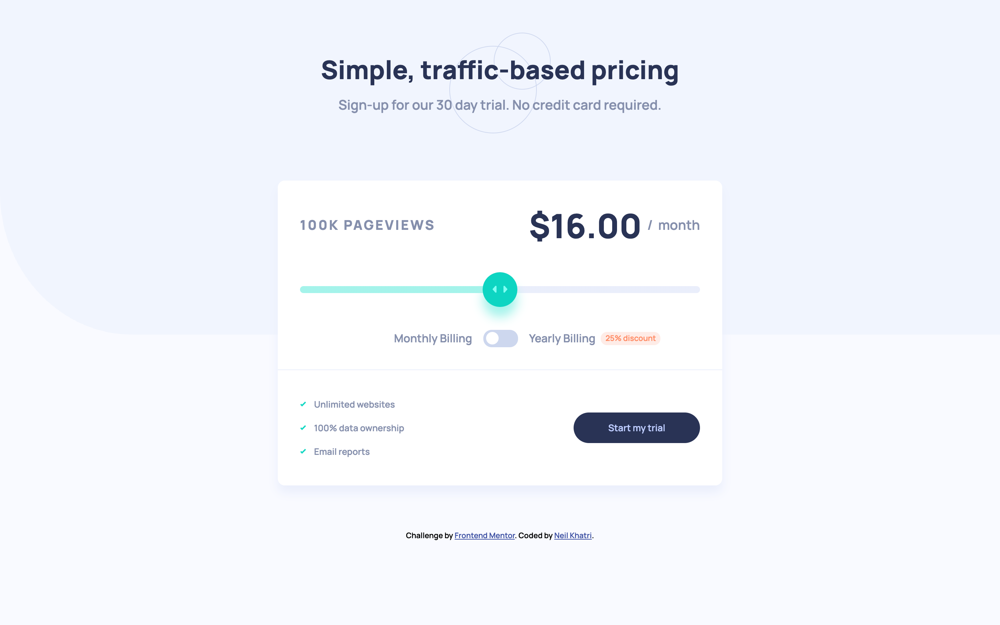
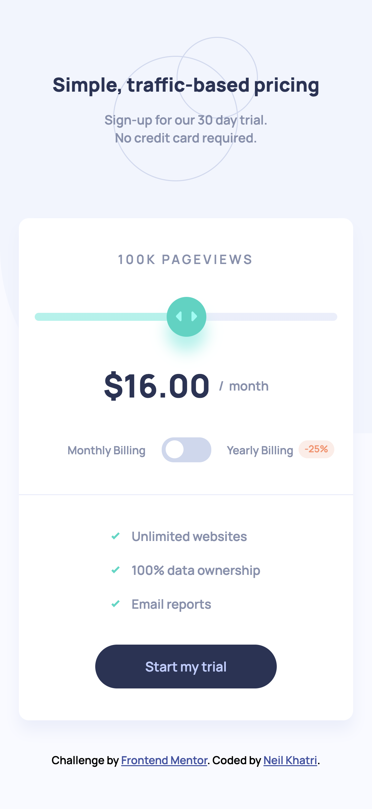

# Frontend Mentor - Interactive pricing component solution

This is a solution to the [Interactive pricing component challenge on Frontend Mentor](https://www.frontendmentor.io/challenges/interactive-pricing-component-t0m8PIyY8). Frontend Mentor challenges help you improve your coding skills by building realistic projects. 

## Table of contents

- [Overview](#overview)
  - [The challenge](#the-challenge)
  - [Screenshot](#screenshot)
  - [Links](#links)
- [My process](#my-process)
  - [Built with](#built-with)
  - [What I learned](#what-i-learned)
  - [Continued development](#continued-development)
  - [Useful resources](#useful-resources)
- [Author](#author)

## Overview

### The challenge

Users should be able to:

- View the optimal layout for the app depending on their device's screen size
- See hover states for all interactive elements on the page
- Use the slider and toggle to see prices for different page view numbers

### Screenshot

### Links

- Solution URL: [Add solution URL here](https://your-solution-url.com)
- Live Site URL: [Add live site URL here](https://your-live-site-url.com)

## My process

### Built with

- Semantic HTML5 markup
- CSS custom properties
- Flexbox
- Vanilla JavaScript

### What I learned

I learnt how to customise range sliders with CSS and how to create a custom toggle. The range slider was relatively difficult to customise but I'm glad I figured out how to do it with the help of some resource on the Internet.

### Continued development

I want to keep improving my JavaScript skills by completing projects that focus more on JavaScript instead of HTML and CSS.

### Useful resources

- [Basic Slider Styling](https://www.w3schools.com/howto/howto_js_rangeslider.asp) - This helped me with the basics of styling a customised range slider.
- [Advanced Slider Styling](https://stackoverflow.com/questions/18389224/how-to-style-html5-range-input-to-have-different-color-before-and-after-slider) - This helped me with the background colour styling for the slider (having different colours before and after the thumb – like a progression bar).
- [Custom Toggle Styling](https://www.w3schools.com/howto/howto_css_switch.asp) – This helped me create a customised toggle.

## Author

- Frontend Mentor - [@nkhatri7](https://www.frontendmentor.io/profile/nkhatri7)
- LinkedIn - [Neil Khatri](https://www.linkedin.com/in/neilkhatri/)
