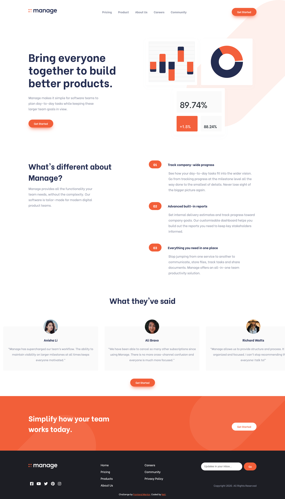

# Frontend Mentor - Manage landing page solution

This is a solution to the [Manage landing page challenge on Frontend Mentor](https://www.frontendmentor.io/challenges/manage-landing-page-SLXqC6P5). Frontend Mentor challenges help you improve your coding skills by building realistic projects. 

## Table of contents

- [Overview](#overview)
  - [The challenge](#the-challenge)
  - [Screenshot](#screenshot)
  - [Links](#links)
- [My process](#my-process)
  - [Built with](#built-with)
  - [Continued development](#continued-development)
- [Author](#author)

## Overview

### The challenge

Users should be able to:

- View the optimal layout for the site depending on their device's screen size
- See hover states for all interactive elements on the page
- See all testimonials in a horizontal slider
- Receive an error message when the newsletter sign up `form` is submitted if:
  - The `input` field is empty
  - The email address is not formatted correctly

### Screenshot

### Links

- [Solution URL](https://www.frontendmentor.io/solutions/responsive-landing-page-using-flexbox-and-vanilla-js-TTkoSoilo)
- [Live Site URL](https://nkhatri7.github.io/Manage-Landing-Page/)

## My process

### Built with

- Semantic HTML5 markup
- CSS custom properties
- Flexbox
- Mobile-first workflow

### Continued development

This challenge was more to just take a step back and solidify my understanding of the HTML5 best practices and make sure I can do the basics at a high level before moving onto more complex challenges. I will probably complete another rather 'basic' challenge and then move onto the more complicated JavaScript challenges where I might use React again.

## Author

- Frontend Mentor - [@nkhatri7](https://www.frontendmentor.io/profile/nkhatri7)
- LinkedIn - [Neil Khatri](https://www.linkedin.com/in/neilkhatri/)
