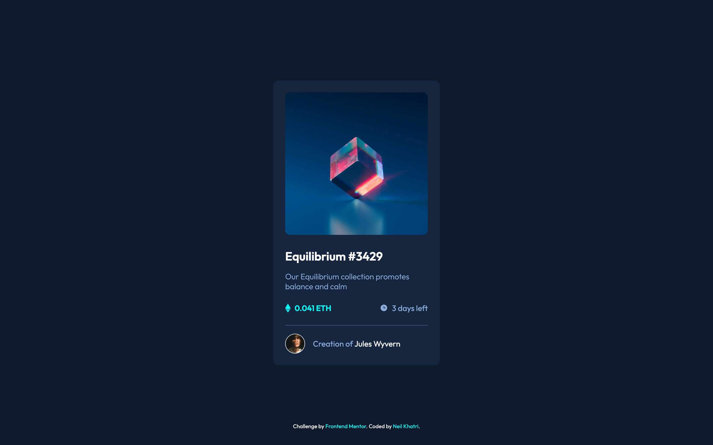

# Frontend Mentor - NFT preview card component solution

This is a solution to the [NFT preview card component challenge on Frontend Mentor](https://www.frontendmentor.io/challenges/nft-preview-card-component-SbdUL_w0U). Frontend Mentor challenges help you improve your coding skills by building realistic projects. 

## Table of contents

- [Overview](#overview)
  - [The challenge](#the-challenge)
  - [Screenshot](#screenshot)
  - [Links](#links)
- [My process](#my-process)
  - [Built with](#built-with)
  - [Continued development](#continued-development)
- [Author](#author)

## Overview

### The challenge

Users should be able to:

- View the optimal layout depending on their device's screen size
- See hover states for interactive elements

### Screenshot

### Links

- [Solution](https://www.frontendmentor.io/challenges/nft-preview-card-component-SbdUL_w0U/hub/mobile-first-nft-preview-card-MmHrlkHeR)
- [Live Site](https://nft-preview-card-nkhatri7.netlify.app/)

## My process

### Built with

- Semantic HTML5 markup
- CSS custom properties
- Flexbox
- Mobile-first workflow

### Continued development

This was just a fun little, easy challenge on a busy day for me so at least I did some coding. I'll continue to work on more intermediate challenges in the coming days.

## Author

- Frontend Mentor - [@nkhatri](https://www.frontendmentor.io/profile/nkhatri)
- LinkedIn - [Neil Khatri](https://www.linkedin.com/in/neilkhatri/)