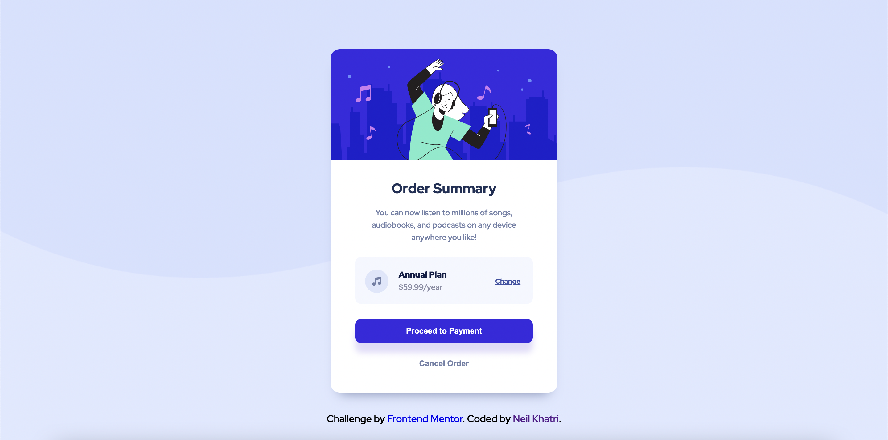

# Frontend Mentor - Order Summary Card Solution

This is a solution to the [Order summary card challenge on Frontend Mentor](https://www.frontendmentor.io/challenges/order-summary-component-QlPmajDUj). Frontend Mentor challenges help you improve your coding skills by building realistic projects. 

## Table of contents

- [Overview](#overview)
  - [The challenge](#the-challenge)
  - [Screenshot](#screenshot)
  - [Links](#links)
- [My process](#my-process)
  - [Built with](#built-with)
  - [What I learned](#what-i-learned)
  - [Continued development](#continued-development)
  - [Useful resources](#useful-resources)
- [Author](#author)

## Overview

### The challenge
The challenge is to build an order summary card component and get it as close to the provided design as possible.
Users should be able to see hover states for interactive elements.

### Screenshot



### Links

- [Solution URL](https://www.frontendmentor.io/solutions/responsive-solution-using-css-flexbox-Jl0Bmom7M)
- [Live Site URL](https://order-summary-component-nkhatri7.netlify.app/)

## My process

### Built with

- Semantic HTML5 markup
- CSS custom properties
- Flexbox
- Mobile-first workflow

### What I learned

One thing I learnt from this challenge is how to position a box-shadow to my liking. If you the shadow to only be visible at the bottom of the element, you need to make the spread (fourth value) the opposite of the v-offset (2nd value). For example:
```css
.order-summary-card {
  box-shadow: 0px 15px 20px -15px hsl(224, 23%, 55%);
}
```

### Continued development

I want to continue learning different CSS concepts and learning how to apply them in different situations. I want to reach a stage where I can comfortably customise the look of most websites through CSS.

### Useful resources

- [W3 Schools CSS box-shadow](https://www.w3schools.com/cssref/css3_pr_box-shadow.asp) - This helped me understand how the box shadow works.

## Author
- Frontend Mentor - [@nkhatri7](https://www.frontendmentor.io/profile/nkhatri7)
- LinkedIn - [Neil Khatri](https://www.linkedin.com/in/neilkhatri/)
