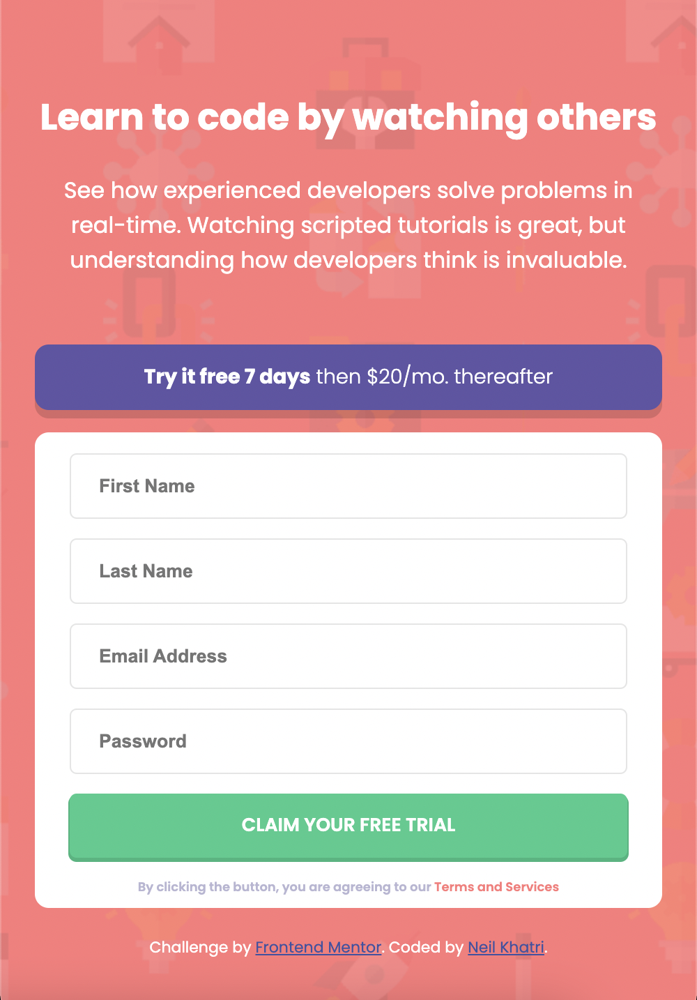

# Frontend Mentor - Intro component with sign up form solution

This is a solution to the [Intro component with sign up form challenge on Frontend Mentor](https://www.frontendmentor.io/challenges/intro-component-with-signup-form-5cf91bd49edda32581d28fd1). Frontend Mentor challenges help you improve your coding skills by building realistic projects. 

## Table of contents

- [Overview](#overview)
  - [The challenge](#the-challenge)
  - [Screenshot](#screenshot)
  - [Links](#links)
- [My process](#my-process)
  - [Built with](#built-with)
  - [What I learned](#what-i-learned)
  - [Continued development](#continued-development)
  - [Useful resources](#useful-resources)
- [Author](#author)
- [Acknowledgments](#acknowledgments)

## Overview

### The challenge

Users should be able to:

- View the optimal layout for the site depending on their device's screen size
- See hover states for all interactive elements on the page
- Receive an error message when the `form` is submitted if:
  - Any `input` field is empty. The message for this error should say *"[Field Name] cannot be empty"*
  - The email address is not formatted correctly (i.e. a correct email address should have this structure: `name@host.tld`). The message for this error should say *"Looks like this is not an email"*

### Screenshot




### Links

- Solution URL: [Solution](https://www.frontendmentor.io/solutions/responsive-signup-form-using-calc-gvIOGzFCV)
- Live Site URL: [Live Site](https://signup-form-brown.vercel.app/)

## My process

### Built with

- Semantic HTML5 markup
- CSS custom properties
- Flexbox
- Mobile-first workflow
- Vanilla JavaScript

### What I learned

I learnt how to put an icon or an image inside an input element. Furthermore, I learnt a JavaScript form method that prevents the form being submitted immediately which allowed time for data validation. The examples for these are seen below:

```css
.invalid-entry {
    background: url(./images/icon-error.svg) no-repeat scroll;
    background-position-y: center;
    background-position-x: calc(5rem + 18vw);
}
```
```js
form.addEventListener('submit', (event) => {
    event.preventDefault();
}
```

### Continued development

I want to continue completing projects with HTML, CSS, and JavaScript. I want to keep practicing until I am comfortable with the the languages so that I can start integrating frameworks.

### Useful resources

- [JavaScript Forms](https://www.javascripttutorial.net/javascript-dom/javascript-form/) - This helped me understand how forms are submitted through JavaScript. I will use the methods in this tutorial in future projects.

## Author

- Frontend Mentor - [@nkhatri7](https://www.frontendmentor.io/profile/nkhatri7)
- LinkedIn - [Neil Khatri](https://www.linkedin.com/in/neilkhatri/)

## Acknowledgments

- [Email Validation Regex](https://stackoverflow.com/questions/46155/how-to-validate-an-email-address-in-javascript) - This is a Stack Overflow post regarding the email validation regex. This was a very useful resource as the regex for email validation is very complicated.
