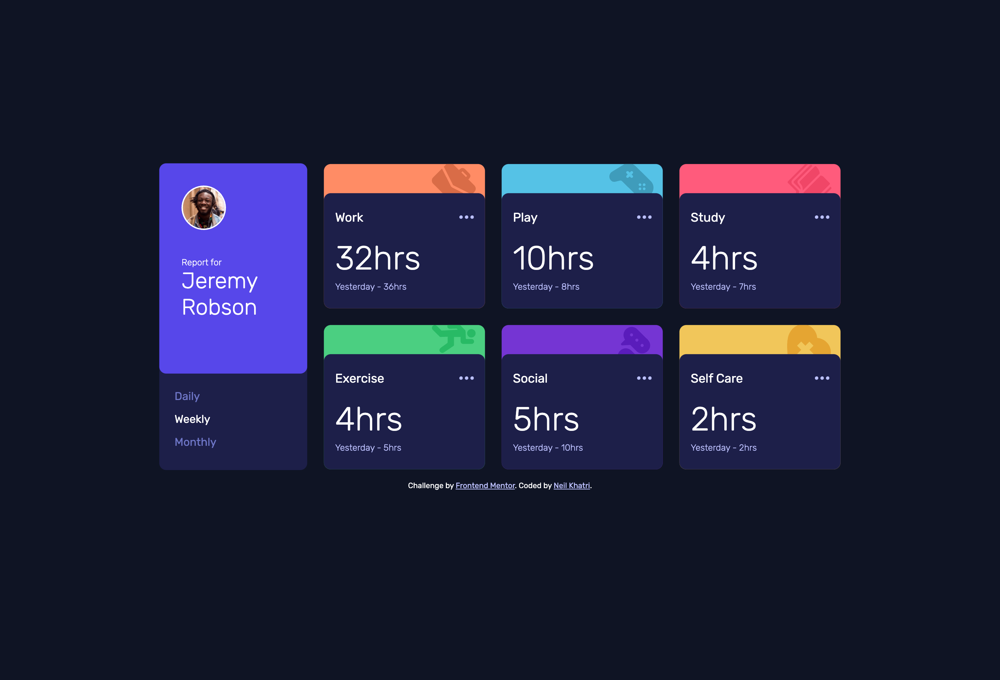
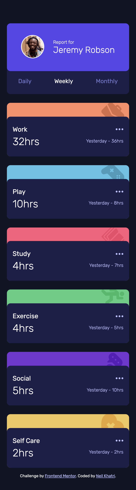

# Frontend Mentor - Time tracking dashboard solution

This is a solution to the [Time tracking dashboard challenge on Frontend Mentor](https://www.frontendmentor.io/challenges/time-tracking-dashboard-UIQ7167Jw). Frontend Mentor challenges help you improve your coding skills by building realistic projects. 

## Table of contents

- [Overview](#overview)
  - [The challenge](#the-challenge)
  - [Screenshot](#screenshot)
  - [Links](#links)
- [My process](#my-process)
  - [Built with](#built-with)
  - [What I learned](#what-i-learned)
  - [Continued development](#continued-development)
  - [Useful resources](#useful-resources)
- [Author](#author)
- [Acknowledgments](#acknowledgments)

## Overview

### The challenge

Users should be able to:

- View the optimal layout for the site depending on their device's screen size
- See hover states for all interactive elements on the page
- Switch between viewing Daily, Weekly, and Monthly stats

### Screenshot




### Links

- Solution URL: [Add solution URL here](https://your-solution-url.com)
- Live Site URL: [Add live site URL here](https://your-live-site-url.com)

## My process

### Built with

- Semantic HTML5 markup
- CSS custom properties
- Flexbox
- CSS Grid
- Vanilla JavaScript

### What I learned

One of the main things I learnt in this challenge is how to work with JSON files using new keywords like async and await, and new functions like fetch. Below is an example of async, await, and fetch in my code:

```js
async function getData() {
  const response = await fetch(URL);
  const data = await response.json();
  return data;
}
```

Another really useful feature I learnt whilst completing this challenge is the data-* attributes, this feature allows you to give a HTML component a custom attribute which can be used to classify a specific component or get a value from a component and it's easily accessible in the JavaScript file. Below is an example of how I used this in my code:

```html
<button data-period="daily" class="time-period-button">Daily</button>
<button data-period="weekly" class="time-period-button active-period">Weekly</button>
<button data-period="monthly" class="time-period-button">Monthly</button>
```
```js
const period = button.dataset.period;
```

### Continued development

I want to continue to work on my JavaScript skills and complete complex projects that require more advanced JavaScript. After this, I'd like to look into frameworks like React.js and Bootstrap or SASS/SCSS. 

### Useful resources

- [data-* attributes](https://developer.mozilla.org/en-US/docs/Learn/HTML/Howto/Use_data_attributes) - This helped me understand data-* attributes and I'm surprised I didn't know about this feature before knowing how handy it is. I really liked this pattern and will use it going forward.

## Author

- Frontend Mentor - [@nkhatri7](https://www.frontendmentor.io/profile/nkhatri7)
- LinkedIn - [Neil Khatri](https://www.linkedin.com/in/neilkhatri/)

## Acknowledgments

I got inspired from [Soransh Singh's](https://www.frontendmentor.io/solutions/time-tracking-dashboard-vanilla-js-RSShRoEoY) solution and how he used the data-* attributes.
