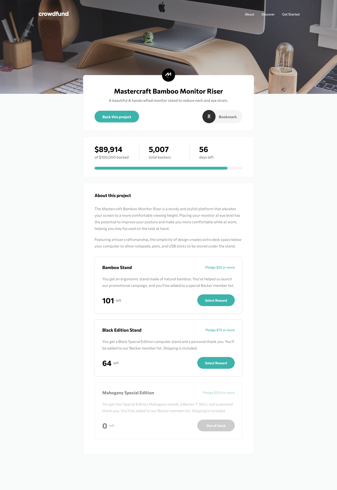

# Frontend Mentor - Crowdfunding product page solution

This is a solution to the [Crowdfunding product page challenge on Frontend Mentor](https://www.frontendmentor.io/challenges/crowdfunding-product-page-7uvcZe7ZR). Frontend Mentor challenges help you improve your coding skills by building realistic projects. 

## Table of contents

- [Overview](#overview)
  - [The challenge](#the-challenge)
  - [Screenshot](#screenshot)
  - [Links](#links)
- [My process](#my-process)
  - [Built with](#built-with)
  - [What I learned](#what-i-learned)
  - [Continued development](#continued-development)
- [Author](#author)

## Overview

### The challenge

Users should be able to:

- View the optimal layout depending on their device's screen size
- See hover states for interactive elements
- Make a selection of which pledge to make
- See an updated progress bar and total money raised based on their pledge total after confirming a pledge
- See the number of total backers increment by one after confirming a pledge
- Toggle whether or not the product is bookmarked

### Screenshot

Mobile screenshot is seen in the completed designs folder which is in the design folder.

### Links

- [Solution URL](https://www.frontendmentor.io/solutions/crowdfunding-product-page-built-with-react-Ho2a6DFmu)
- [Live Site](https://frontend-mentor-challenges-rho.vercel.app/)

## My process

### Built with

- Semantic HTML5 markup
- CSS custom properties
- Flexbox
- [React](https://reactjs.org/) - JS library
- [React Modal](https://github.com/reactjs/react-modal) - Accessible modal dialog component for React.js

### What I learned

I learnt how to use the Modal component from React and how all of the in-built methods work. I also learnt a lot about state management in React and how to pass methods onto child components as props – this is really useful when working with states and updating states in the parent component through actions in the child component.

### Continued development

I want to keep creating React apps to further my knowledge and understanding of the library. I am more comfortable with using states and passing information between child and parent components now. I would like to learn how to use React hooks.

## Author

- Frontend Mentor - [@nkhatri7](https://www.frontendmentor.io/profile/nkhatri7)
- LinkedIn - [Neil Khatri](https://www.linkedin.com/in/neilkhatri/)