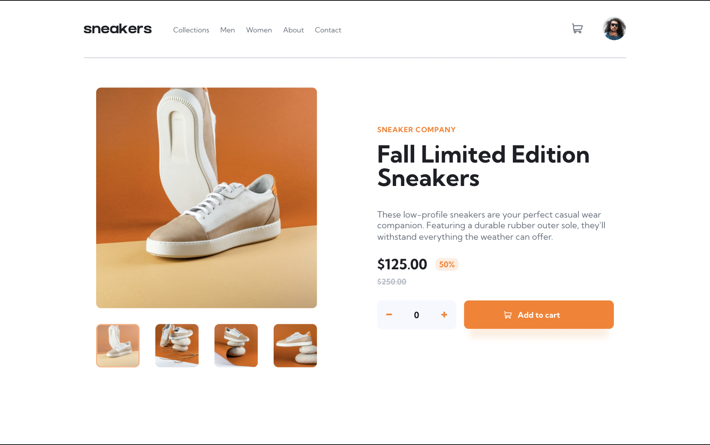

# Frontend Mentor - E-commerce product page solution

This is a solution to the [E-commerce product page challenge on Frontend Mentor](https://www.frontendmentor.io/challenges/ecommerce-product-page-UPsZ9MJp6). Frontend Mentor challenges help you improve your coding skills by building realistic projects.

## Table of contents

- [Overview](#overview)
  - [The challenge](#the-challenge)
  - [Screenshot](#screenshot)
  - [Links](#links)
- [My process](#my-process)
  - [Built with](#built-with)
  - [Continued development](#continued-development)
- [Author](#author)

## Overview

### The challenge

Users should be able to:

- View the optimal layout for the site depending on their device's screen size
- See hover states for all interactive elements on the page
- Open a lightbox gallery by clicking on the large product image
- Switch the large product image by clicking on the small thumbnail images
- Add items to the cart
- View the cart and remove items from it

### Screenshot

### Links

- [Solution URL](https://www.frontendmentor.io/challenges/ecommerce-product-page-UPsZ9MJp6/hub/mobile-first-ecommerce-product-page-built-with-react-and-scss-cwtLGJrj1)
- [Live Site](https://e-commerce-product-page-nkhatri7.netlify.app/)

## My process

### Built with

- Semantic HTML5 markup
- CSS custom properties
- Flexbox
- Mobile-first workflow
- [React](https://reactjs.org/) - JS library
- SASS/SCSS

### Continued development

This challenge was not too difficult, the most difficult part of this challenge was the lightbox, I was deciding whether to make the changes in images in the lightbox synchronous with the images in the main view, in the end I decided not to and just ensured that the initial image displayed in the lightbox was the image being displayed in the main view, from that point on the changes would not be shown in the main view but only in the lightbox. This is my last intermediate challenge for the time being (until there's new challenges) – so I'll be doing the REST countries API challenge next which is an advanced challenge.

## Author

- Frontend Mentor - [@nkhatri7](https://www.frontendmentor.io/profile/nkhatri7)
- LinkedIn - [Neil Khatri](https://www.linkedin.com/in/neilkhatri/)
